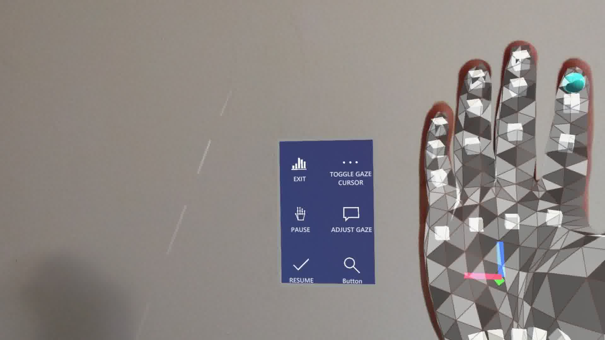
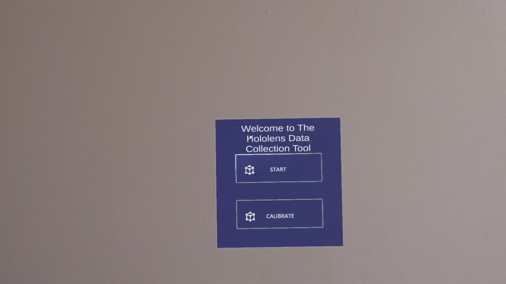

# ACVHoloLens

**An Active Computer Vision Augmented Reality Platform**

The goal of this project is to develop a platform that will allow for the deployment and collection of weakly annotated data in an augmented reality setting. This is a tool for obtaining video, audio, and eye-gaze data from a user wearing the Microsoft HoloLens 2. 

The project is split up into two main parts:

* An app for the Hololens 2 which is built using Unity with the help of several different APIs and toolkits.
* Server side app developed in Python which can be executed on any machine.
 
Data is collected on the HoloLens 2 and then streamed to the server using TCP/IP sockets. 

<p align="center">
    
    
    
</p>


## Requirements

A Windows 10 machine is required to develop and deploy applications for the HoloLens 2. Any OS can be used for the server side Python app.

* Python >= 3.7.6
  * ffmpeg_python==0.2.0
  * numpy==1.21.6
  * opencv==4.5.5.64
  * PyAudio==0.2.11
  * vosk==0.3.42
 
* For HoloLens 2 app development
  * Unity Hub and Unity 2020.3.33f1 LTS
  * Visual Studio Code 2019
  * Microsoft Mixed Reality Toolkit 2.8.2
  * Mixed Reality OpenXR Plugin 1.4.4

## Installation
Clone this repository to your machine and open the Unity project from Unity Hub. 

Follow the instructions found in this link to build the project and generate a Visual Studio Solution: https://docs.microsoft.com/en-us/windows/mixed-reality/develop/unity/build-and-deploy-to-hololens

Then follow the instructions in this link to deploy the application to the Hololens 2: https://docs.microsoft.com/en-us/windows/mixed-reality/develop/advanced-concepts/using-visual-studio?tabs=hl2

Deploying via USB is recommended as its faster than deploying over remote connection. Once the deployment is done you should see an app titled "ACVHololensUnity" in the list of apps on the HoloLens. 

On the server side, cd into the project directory and 'pip install -r requirements.txt'

## Usage

Firstly, cd into the server side project directory if you have not already. Create a new folder where the data collected from the HoloLens will be stored. 
Run the following command: 

```
python server.py --base_data_folder {YOUR_FOLDER}
```

You will see that the server sockets are listening on some IP address.

If both the machine the server is running on and the HoloLens are connected to Wifi (and the user wont be going into areas without Wifi signal) then no USB-C connection is required between the HoloLens and the machine. Otherwise, a portable machine would have to be used e.g. Raspberry Pi or a laptop which would be connected to the HoloLens via USB-C. 

Make sure that the HoloLens is calibrated to your eyes. If not, go to the HoloLens privacy settings and run the eye calibration routine.

Now, go onto the HoloLens and open the ACVHololensUnity app. You should see a welcome screen with a start button. Once you press the start button, a dialog box will appear asking you to input the IP Address of the server. If the default IP address is different than the one assigned to your server then select yes to change it. Note that the app will not allow you to continue until you have entered a valid IP address. After an IP address has been entered, a countdown will begin before you can start collecting data in your environment. You should see a message appearing that the client sockets have connected to the server sockets and you can being collecting data. 

If you lift your hand with your palm facing towards you, a menu screen will pop-up which showing several buttons: Exit, Pause (pause data collection and streaming to the server), Resume (resume collecting and streaming data), Toggle (turns on/off the eye gaze cursor) and adjust gaze angle*.

Once data collection is finished, you can exit the app. 

Now on the server side, you will notice a new folder has been created inside your data collection folder. Its named to the date and time you started the server for a particular data collection run. Inside this folder, you will find the following folders/files:

* "frames" folder containing all of the video frames collected.
* "audio_data" folder containing the audio files
    * numbered .wav files (new wav file is created every time pause is pressed in the HoloLens app)
    * one text file contains a list of timestamps when the recording started
    * one text file contains the names of the .wav files that correspond to the timestamps
* "frame_timestamps.csv" contains the name of a video frame and the corresponding timestamp of when it was captured.
* "gaze_data.csv" contains the eye gaze data (in (x,y) pixel coordinates) and the corresponding timestamps when a certain eye gaze point was collected

Note: delete the last audio .wav file (it is an empty file that's created when the app is exited)

You can optionally run the following command to visualize the data collected for the run. Just note that this will take some time if your run was long. Also, make sure there enough storage space since a new copy of every captured frame overlayed with eye-gaze points will be created.

```
python process_and_visualize.py --data_folder {path_to_run_folder} 
```

This command will: 
* create an output folder
* sync and place the eye gaze data onto the video frames (these new frames will be in a newly created "gaze_frames" folder)
* create variable frame rate videos from the frames (multiple videos if the recording is paused)
* concatenate the videos
* sync the audio and video and video files and concatenate them to create a single video file in the output folder

<p align="center">
    
    
    
    
</p>

Now run the following command:

```
python text_generator.py --data_folder {path_to_run_folder} 
```
This will create a json file that contains all of the text that was generated from the audio files.

Now you can create a new text file named 'categories.txt' where each row contains the name of an object you annotated during the data collection run. You should also create a json file with the list of categories in the COCO dataset format named 'categories.json'. 

Run 

```
python generate_dataset.py --data_folder {path_to_run_folder} 
```

to create a json file that contains a list of all detected instances of categories of interest with images and corresponding gaze points.


## Additional Resources

Create a new Unity project and add the Microsoft MRTK and OpenXR Plugin to the project: https://docs.microsoft.com/en-us/learn/modules/mixed-reality-toolkit-project-unity/1-introduction

Enable eye-tracking in project (if you are creating a new Unity project from scratch): https://docs.microsoft.com/en-us/windows/mixed-reality/mrtk-unity/mrtk2/features/input/eye-tracking/eye-tracking-basic-setup?view=mrtkunity-2022-05. Make sure to check "Enable Eye Gaze" in the Pointers section of Input settings. 